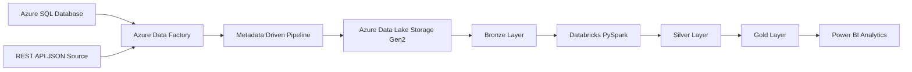
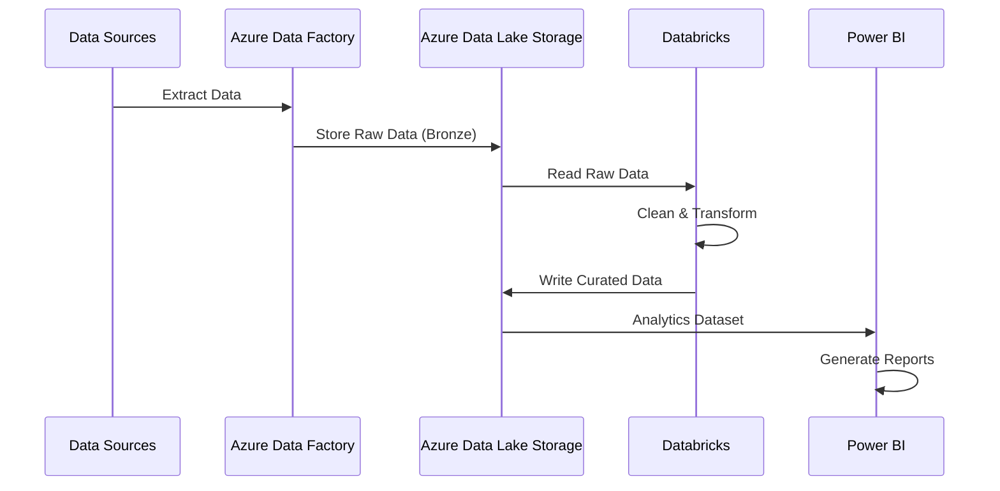
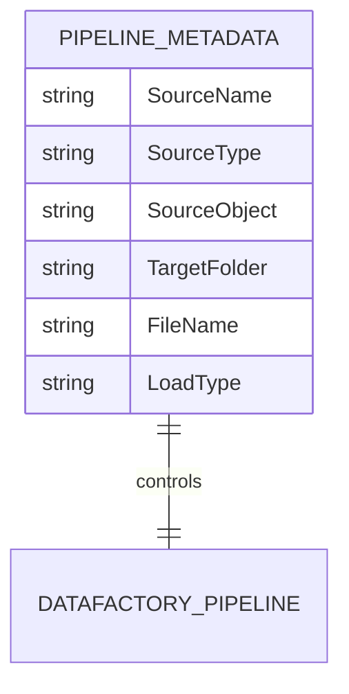

# Retail Data Modernization Platform – Azure Lakehouse Architecture

> A cloud-based retail analytics platform built using Azure Data Factory, Azure Data Lake Storage Gen2, Databricks, PySpark, Delta Lake concepts, Azure SQL, and Power BI following a Medallion Lakehouse architecture.


---

# Overview

## Problem Statement

Retail organizations commonly receive data from multiple sources such as transactional databases and external APIs. Managing this data manually creates challenges around:

* Data consistency
* Scalability
* Data quality
* Reporting speed
* Analytics readiness

This project implements a modern cloud data platform that automates ingestion, transformation, storage, and analytics using Azure services.

## Project Purpose

The solution creates an end-to-end retail data pipeline that:

* Ingests data from Azure SQL Database and REST API sources
* Stores raw data in Azure Data Lake Storage Gen2
* Cleans and transforms data using PySpark
* Creates analytics-ready datasets
* Provides business insights through Power BI dashboards

The architecture follows a scalable **Medallion Lakehouse approach**:

```
Bronze Layer  →  Silver Layer  →  Gold Layer
Raw Data         Clean Data       Business Analytics
```

---

# Key Features

## Dynamic Metadata Driven Data Ingestion

The pipeline uses a metadata-driven approach where ingestion behavior is controlled through a metadata table.

Features:

* Reads pipeline metadata dynamically
* Supports multiple source types
* Reduces hardcoded pipeline logic
* Enables scalable onboarding of new datasets

---

## Multi-Source Data Integration

The platform supports:

### Azure SQL Sources

Examples:

* Transactions
* Stores
* Products

### API Sources

Example:

* Customer JSON data

---

## Azure Data Factory Orchestration

The ingestion pipeline automates:

* Metadata lookup
* Source validation
* Dynamic copy activities
* Data movement into ADLS Bronze layer

---

## Medallion Data Architecture

### Bronze Layer

Stores raw ingested data.

Example:

```
retail/bronze/
    transaction/
    store/
    product/
    customer/
```

---

### Silver Layer

Implemented using Databricks PySpark.

Responsibilities:

* Data cleaning
* Schema processing
* Data quality improvements
* Transformation logic

---

### Gold Layer

Creates analytics-ready datasets.

Used for:

* Sales analysis
* Customer insights
* Product performance analytics

---

## Business Intelligence Integration

Power BI is connected with curated Gold layer datasets for reporting and visualization.

---

# Project Architecture

## High-Level Workflow



---

# Component Interaction



---

# Technology Stack

| Category           | Technology                   | Purpose                                |
| ------------------ | ---------------------------- | -------------------------------------- |
| Cloud Platform     | Microsoft Azure              | Cloud infrastructure                   |
| Data Orchestration | Azure Data Factory           | Pipeline automation                    |
| Storage            | Azure Data Lake Storage Gen2 | Data lake storage                      |
| Processing         | Azure Databricks             | Distributed data processing            |
| Programming        | PySpark                      | Data transformation                    |
| Data Architecture  | Medallion Architecture       | Layered data design                    |
| Database           | Azure SQL Database           | Source metadata and relational storage |
| Analytics          | Power BI                     | Reporting and visualization            |
| Data Format        | JSON / Parquet               | Data storage formats                   |
| Version Control    | GitHub                       | Project repository management          |

---

# Project Structure

```
Retail-Data-Modernization-Platform-Azure-Lakehouse-Architecture
│
├── dataset/
│   ├── DS_ADLS_DYNAMIC.json
│   ├── DS_API_DYNAMIC.json
│   ├── DS_METADATA.json
│   └── DS_SQL_DYNAMIC.json
│
├── linkedService/
│   ├── LS_ADLS_RETAIL.json
│   ├── LS_GITHUB_API.json
│   └── LS_SQL_RETAIL.json
│
├── factory/
│   └── retail-azuredatafactory.json
│
├── pipeline/
│   └── PL_RETAIL_INGESTION.json
│
├── notebooks/
│   ├── Silver Layer.ipynb
│   └── Gold layer.ipynb
│
├── datasets/
│   ├── customers.json
│   └── SQL scripts
│
├── images/
│   ├── Architecture screenshots
│   ├── ADF screenshots
│   └── Power BI report
│
└── SCRIPT SQL.txt
```

---

# Folder Explanation

## dataset/

Contains Azure Data Factory dataset definitions.

Purpose:

* Defines source and target structures
* Connects pipelines with storage/database objects

---

## linkedService/

Contains connection configurations.

Includes:

* Azure SQL connection
* ADLS Gen2 connection
* API connection

---

## pipeline/

Contains Azure Data Factory pipeline JSON.

Main pipeline:

```
PL_RETAIL_INGESTION
```

Responsibilities:

* Metadata lookup
* Dynamic processing
* Source routing
* Data ingestion

---

## notebooks/

Contains Databricks transformation logic.

### Silver Layer Notebook

Responsibilities:

* Reads Bronze data
* Performs cleaning
* Creates cleaned datasets

### Gold Layer Notebook

Responsibilities:

* Aggregations
* Business-level transformations
* Analytics preparation

---

# How It Works

## Step 1: Metadata Lookup

Azure Data Factory reads ingestion metadata:

```
Pipeline_Metadata
```

The metadata determines:

* Source type
* Source object
* Target location
* Load strategy

---

## Step 2: Data Extraction

ADF dynamically checks source type.

Example:

```
IF SourceType = SQL

        Extract from Azure SQL


ELSE

        Extract from API
```

---

## Step 3: Bronze Data Storage

Raw data is stored in ADLS Gen2.

Example:

```
ADLS

retail
 |
 └── bronze
      |
      ├── transaction
      ├── product
      ├── store
      └── customer
     
     
```

---

## Step 4: Data Transformation

Databricks reads Bronze data.

Processing includes:

* Cleaning
* Schema inference
* Transformation
* Business rules

---

## Step 5: Gold Analytics Layer

Aggregated datasets are created for reporting.

Example metrics:

* Total sales
* Quantity sold
* Product performance
* Store analysis

---

## Step 6: Visualization

Power BI consumes Gold datasets and provides analytics dashboards.

---

# Installation & Setup

## Requirements

Before deployment:

* Azure Subscription
* Azure Data Factory
* Azure Data Lake Storage Gen2
* Azure Databricks Workspace
* Azure SQL Database
* Power BI Desktop

---

# Deployment Steps

## 1. Create Azure Resources

Create:

* Storage Account
* Data Factory
* Databricks Workspace
* SQL Database

---

## 2. Configure Linked Services

Update:

```
linkedService/
```

with your Azure environment details.

---

## 3. Import Data Factory Components

Import:

```
pipeline/
dataset/
linkedService/
factory/
```

into Azure Data Factory.

---

## 4. Configure Databricks

Upload notebooks:

```
notebooks/

Silver Layer.ipynb
Gold layer.ipynb
```

---

## 5. Run Pipeline

Execute:

```
PL_RETAIL_INGESTION
```

---

# Usage Guide

After deployment:

1. Load source data
2. Execute ADF ingestion pipeline
3. Verify Bronze layer
4. Run Databricks transformations
5. Validate Silver/Gold datasets
6. Open Power BI dashboard

---

# Database Design

## Metadata Table

The pipeline uses a metadata-driven ingestion table:

```
Pipeline_Metadata
```

Example fields:

| Column       | Purpose          |
| ------------ | ---------------- |
| SourceName   | Dataset name     |
| SourceType   | SQL/API          |
| SourceObject | Source location  |
| TargetFolder | ADLS destination |
| FileName     | Output file      |
| LoadType     | Loading strategy |

---

# Data Flow Diagram



---

# Code Quality & Engineering Practices

## Modular Architecture

Project separates:

* Connections
* Pipelines
* Datasets
* Transformations

---

## Metadata Driven Design

Benefits:

* Less duplication
* Easier maintenance
* Scalable ingestion

---

## Cloud Native Design

Uses managed Azure services:

* ADF
* ADLS
* Databricks
* Power BI

---

## Scalability

The architecture supports:

* Additional datasets
* Additional sources
* Larger data volumes

---

# Challenges & Solutions

## Challenge: Multiple Data Sources

Solution:

Implemented dynamic ingestion using metadata configuration.

---

## Challenge: Data Processing Scalability

Solution:

Used Spark-based processing through Databricks.

---

## Challenge: Separating Raw and Analytics Data

Solution:

Implemented Bronze, Silver, and Gold layers.

---

# Future Improvements

Possible enhancements:

* Add automated data quality checks
* Implement Azure Key Vault for secrets management
* Add CI/CD deployment pipelines
* Add monitoring and alerting
* Implement incremental loading
* Add Delta Lake optimization
* Add automated testing framework

---

# Screenshots / Demo

Add project screenshots here:

```
/images

- Azure Data Factory Pipeline
- Databricks Transformation
- Power BI Dashboard
```

---

# Contributing

Contributions are welcome.

Steps:

1. Fork repository
2. Create feature branch

```
git checkout -b feature/new-feature
```

3. Commit changes

```
git commit -m "Add new feature"
```

4. Push changes

```
git push origin feature/new-feature
```

5. Create Pull Request

---

# License

This project is available under the MIT License.

---

# Author

**Priya Ramteke**

Azure Data Engineering Project Portfolio

Skills demonstrated:

* Azure Data Factory
* Azure Data Lake
* Databricks
* PySpark
* SQL
* Power BI
* Data Engineering Architecture


